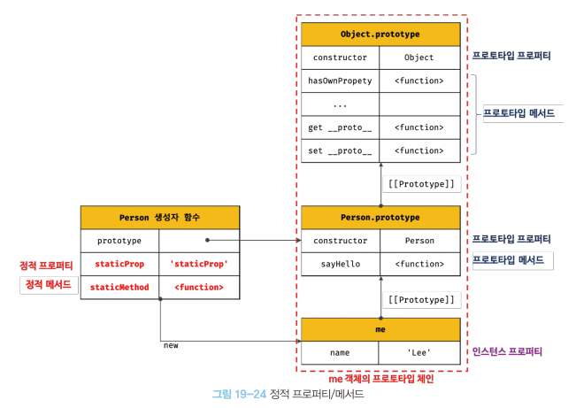

제 19장 프로토타입
====================

자바스크립트는 명령형, 함수형, 프로토타입 기반 객체지향 프로그래밍을 지원하는 멀티 패러다임 프로그래밍 언어다.   
자바스크립트는 객체 기반의 프로그래밍 언어이며. 원시 타입의 값을 제외한 나머지 값들은 모두 객체다.

19.1 객체지향 프로그래밍
-------------------------
객체지향 프로그래밍은 여러 개의 독립적 단위, 즉 객체의 집합으로 프로그램을 표현하려는 패러다임을 말한다.  
**객체** : 상태 데이터와 동작을 하나의 논리적인 단위로 구성한 복합적인 자료구조   
**프로퍼티** : 객체의 상태 데이터   
**메서드** : 동작

19.2 상속과 프로토타입
------------------------
**상속** : 어떤 객체의 프로퍼티 또는 메서드를 다른 객체가 상속받아 그대로 사용할 수 있는 것   

자바스크립트는 프로토타입을 기반으로 상속을 구현하여 불필요한 중복을 제거한다.
<br/>
<p align="center">
  </img>
</p>
<br/>

* 생성자 함수가 생성할 모든 인스턴스가 공통적으로 사용할 프로퍼티나 메서드를 프로토타입에 미리 구현해두면 생성자 함수가 생성할
모든 인스턴스는 별도의 구현없이 상위 객체인 프로토타입의 자산을 공유하여 사용할 수 있다.

19.3 프로토타입 객체
-----------------------
* 프로토타입 객체란 객체지향 프로그래밍의 근간을 이루는 객체 간 상속을 구현하기 위해 사용된다.   
프로토타입은 어떤 객체의 상위 객체의 역할을 하는 객체로서 다른 객체에 공유 프로퍼티를 제공한다.   
프로토타입을 상속받은 하위 객체는 상위 객체의 프로퍼티를 자신의 프로퍼티처럼 자유롭게 사용할 수 있다.   

* 모든 객체는 [[Prototype]]이라는 내부 슬롯을 가지며, 이 내부 슬롯의 값은 프로토타입의 참조다.   
객체가 생성될 때 객체 생성 방식에 따라 프로토타입이 결정되고 [[Prototype]]에 저장된다.   

* 객체 리터럴에 의해 생성된 객체의 프로토타입은 Object.prototype이고,   
생성자 함수에 의해 생성된 객체의 프로토타입은 생성자 함수의 prototype 프로퍼티에 바인딩되어 있는 객체다.

* 모든 객체는 하나의 프로토타입을 갖는다. 그리고 모든 프로토타입은 생성자 함수와 연결되어 있다.   
<br/>
<p align="center">
  </img>
</p>
<br/>

[[Prototype]] 내부 슬롯에 직접 접근할 수는 없지만, __ prototype __ 접근자 프로퍼티를 통해 자신의 프로토타입, 즉 자신의 [[Prototype]] 내부 슬롯이 가리키는 프로토타입에 간접적으로 접근할 수 있다.   

프로토타입은 자신의 constructor 프로퍼티를 통해 생성자 함수에 접근할 수 있고, 생성자 함수는 자신의 prototype 프로퍼티를 통해 
프로토타입에 접근할 수 있다.

### 19.3.1 __ prototype __ 접근자 프로퍼티   
모든 객체는 __ prototype __ 접근자 프로퍼티를 통해 자신의 프로토타입, 즉 자신의 [[Prototype]] 내부 슬롯에 간접적으로 접근할 수 있다.

__1. __ prototype __ 는 접근자 프로퍼티다.__
*  [[Prototype]] 내부 슬롯에는 직접 접근할 수 없으며, __ prototype __ 접근자 프로퍼티를 통해 간접적으로 [[Prototype]] 내부 슬롯의 값, 즉 프로토타입에 접근할 수 있다.
*  접근자 프로퍼티는 자체적으로 값([[Value]] 프로퍼티)를 갖지 않고 접근자 함수([[Get]], [[Set]]) 프로퍼티 어트리뷰트로 구성된 프로퍼티다.
*  __ prototype __ 접근자 프로퍼티를 통해 프로토타입에 접근하면 내부적으로 __ prototype __ 접근자 프로퍼티의 [[Get]]이 호출된다.   
__ prototype __ 접근자 프로퍼티를 통해 새로운 프로토타입을 할당하면 __ prototype __ 접근자 프로퍼티의 [[Set]]이 호출된다.

__2. __ prototype __ 접근자 프로퍼티는 상속을 통해 사용된다.__
* __ prototype __ 접근자 프로퍼티는 객체가 직접 소유하는 프로퍼티가 아니라 Object.prototype의 프로퍼티다.   
모든 객체는 상속을 통해 Object.prototype.__ prototype __ 접근자 프로퍼티를 사용할 수 있다.

__3. __ prototype __ 접근자 프로퍼티를 통해 프로토타입에 접근하는 이유__
* [[Prototype]] 내부 슬롯의 값, 즉 프로토타입에 접근하기 위해 접근자 프로퍼티를 사용하는 이유는 상호 참조에 의해 프로토타입 체인이 생성되는 것을 방지하기 위해서이다.
* 프로퍼티 검색 방향이 한쪽 방향으로만 흘러가야 한다. 객체끼리 서로가 자신의 프로토타입이 되는 비정상적인 프로토타입 체인이 만들어지면 프로토타입 체인 종점이 존재하지 않아서 프로퍼티를 검색할 때 무한 루프에 빠진다.

__4. __ prototype __ 접근자 프로퍼티를 코드 내에서 직접 사용하는 것은 권장하지 않는다.__
* 모든 객체가 __ prototype __ 접근자 프로퍼티를 사용할 수 있는 것은 아니다. 직접 상속을 통해 Object.prototype을 상속받지 않는 객체를 생성할 수도 있기 때문에 __ prototype __ 접근자 프로퍼티를 사용할 수 없는 경우가 있다.
* __ prototype __ 접근자 프로퍼티 대신 프로토타입의 참조를 취득하고 싶은 경우에는 Object.getPrototypeOf 메서드를 사용   
프로토타입을 교체하고 싶은 경우에는 Object.setPrototypeOf 메서드를 사용할 것을 권장한다.
<br/>
<p align="center">
  </img>
</p>
<br/>

### 19.3.2 함수 객체의 prototype 프로퍼티   
* 함수 객체만이 소유하는 prototype 프로퍼티는 생성자 함수가 생성할 인스턴스의 프로토타입을 가리킨다.(일반 객체는 소유 x)   

* 생성자 함수로서 호출할 수 없는 함수, 즉 non-constructor인 화살표 함수와 ES6 메서드 축약 표현으로 정의한 메서드는 prototype 프로퍼티를 소유하지 않으며 프로토타입도 생성하지 않는다.

* 모든 객체가 가지고 있는 (Object.prototype으로부터 상속받은) __ prototype __ 접근자 프로퍼티와 함수 객체만이 가지고 있는 prototype 프로퍼티는 결국 동일한 프로토타입을 가리킨다. 
<br/>
<p align="center">
  </img>
</p>
<br/>

### 19.3.3 프로토타입의 constructor 프로퍼티와 생성자 함수   
모든 프로토타입은 constructor 프로퍼티를 갖는다.   
이 constructor 프로퍼티는 prototype 프로퍼티로 자신을 참조하고 있는 생성자 함수를 가리킨다.   
이 연결은 생성자 함수가 생성될 때, 즉 함수 객체가 생성될 때 이뤄진다.

19.4 리터럴 표시에 의해 생성된 객체의 생성자 함수와 프로토타입
----------------------------------------------------------------
* 생성자 함수에 의해 생성된 인스턴스는 프로토타입의 constructor 프로퍼티에 의해 생성자 함수와 연결된다.   
이때 constructor 프로퍼티가 가리키는 생성자 함수는 인스턴스를 생성한 생성자 함수다.

* 리터럴 표기법에 의한 객체 생성 방식과 같이 명시적으로 new 연산자와 함께 생성자 함수를 호출하여 인스턴스를 생성하지 않는 객체 생성 방식도 있다.   
리터럴 표기법에 의해 생성된 객체도 물론 프로토타입이 존재한다.   
하지만 이런 객체의 경우 프로토타입의 constructor 프로퍼티가 가리키는 생성자 함수가 반드시 객체를 생성한 생성자 함수라고 단정할 수는 없다. (객체 리터럴에 의해 생성된 객체는 Object 생성자 함수가 생성한 객체가 아니다.)

* 프로토타입은 생성자 함수와 더불어 생성되며 prototype, construtor 프로퍼티에 의해 연결되어 있다.   
프로토타입과 생성자 함수는 단독으로 존재할 수 없고 언제나 쌍으로 존재한다.

* 프로토타입의 constructor 프로퍼티를 통해 연결되어 있는 생성자 함수를, 리터럴 표기법으로 생성한 객체를 생성한 생성자 함수로 생각해도 됨

19.5 프로토타입의 생성 시점
-------------------------------
* 객체는 리터럴 표기법 또는 생성자 함수에 의해 생성되므로 결국 모든 객체는 생성자 함수와 연결되어 있다.
* 프로토타입은 생성자 함수가 생성되는 시점에 더불어 생성된다.

### 19.5.1 사용자 정의 생성자 함수와 프로토타입 생성 시점   
* 생성자 함수로서 호출할 수 있는 함수, 즉 constructor는 함수 정의가 평가되어 함수 객체를 생성하는 시점에 프로토타입도 더불어 생성된다.
* 생성자 함수로서 호출할 수 없는 함수, 즉 non-constructor는 프로토타입이 생성되지 않는다.
* 빌트인 생성자 함수가 아닌 사용자 정의 생성자 함수는 자신이 평가되어 함수 객체로 생성되는 시점에 프로토타입도 더불어 생성되며, 생성된 프로토타입의 프로토타입은 언제나 Obejct.prototype이다.

### 19.5.2 빌트인 생성자 함수와 프로토타입 생성 시점   
* 빌트인 생성자 함수(Object, String, Number, Function, Array ...)도 일반 함수와 같이 빌트인 생성자 함수가 생성되는 시점에 프로토타입이 생성된다.   
모든 빌트인 생성자 함수는 전역 객체가 생성되는 시점에 생성된다.   
생성된 프로토타입은 빌트인 생성자 함수의 prototype 프로퍼티에 바인딩된다.

* 이처럼 객체가 생성되기 이전에 생성자 함수와 프로토타입은 이미 객체화되어 존재한다.   
이후 생성자 함수 또는 리터럴 표기법으로 객체를 생성하면 프로토타입은 생성된 객체의 [[Prototype]] 내부 슬롯에 할당된다.   
이로써 생성된 객체는 프로토타입을 상속받는다.

19.6 객체의 생성 방식과 프로토타입의 결정
------------------------------------------
* 모든 객체는 추상 연산자 OrdinaryObjectCreate에 의해 생성된다는 공통점이 있다.
* 추상 연산자 OrdinaryObjectCreate는 필수적으로 자신이 생성할 객체의 프로토타입을 인수로 전달 받는다.   
그리고 자신이 생성할 객체에 추가할 프로퍼티 목록을 옵션으로 전달할 수 있다.   
추상 연산자 OrdinaryObjectCreate는 빈 객체를 생성할 후, 객체에 추가할 프로퍼티 목록이 인수로 전달될 경우 프로퍼티를 객체에 추가한다. 그리고 인수로 전달받은 프로토타입을 자신이 생성한 객체의 [[Prototype]] 내부 슬롯에 할당한 다음, 생성한 객체를 반환한다.

### 19.6.1 객체 리터럴에 의해 생성된 객체의 프로토타입   
* js엔진은 객체 리터럴을 평가하여 객체를 생성할 때 추상 연산자 OrdinaryObjectCreat를 호출한다.   
이때 추상 연산 OrdinaryObjectCreate에 전달되는 프로토타입은 Object.prototype이다.   
즉, 객체 리터럴에 의해 생성되는 객체의 프로토타입은 Object.prototype이다. (Object.prototype 객체를 상속받음)

### 19.6.2 Object 생성자 함수에 의해 생성된 객체의 프로토타입   
* Object 생성자 함수를 인수 없이 호출하면 빈 객체가 생성된다.   
Object 생성자 함수를 호출하면 객체 리터럴과 마찬가지로 추상 연산 OrdinaryObjectCreate가 호출된다.   
이때 추상 연산 OrdinaryObjectCreate에 전달되는 프로토타입은 Object.prototype이다.   
즉, Object 생성자 함수에 의해 생성되는 객체의 프로토타입은 Object.prototype이다. (Object.prototype 객체를 상속받음)

* 객체 리터럴 방식은 객체 리터럴 내부에 프로퍼티를 추가하지만 Object 생성자 함수 방식은 일단 빈 객체를 생성한 이후 프로퍼티를 추가해야 한다.

### 19.6.3 생성자 함수에 의해 생성된 객체의 프로토타입   
* 생성자 함수를 호출하면 다른 객체 생성 방식과 마찬가지로 추상 연산 OrdinaryObjectCreate가 호출된다.   
이때 추상 연산 OrdinaryObjectCreate에 전달되는 프로토타입은 생성자 함수의 prototype 프로퍼티에 바인딩되어 있는 객체다.   
즉, 생성자 함수에 의해 생성되는 객체의 프로토타입은 생성자 함수의 prototype 프로퍼티에 바이딩되어 있는 객체다. 

* 표준 빌트인 객체인 Object 생성자 함수와 더불어 생성된 프로토타입 Object.prototype은 다양한 빌트인 메서드를 갖고 있다.   
하지만 사용자 정의 생성자 함수와 더불어 생성된 프로토타입의 프로퍼티는 constructor 뿐이다. 

19.7 프로토타입 체인
----------------------
* **프로토타입 체인** : 자바스크립트는 객체의 프로퍼티에 접근하려고 할 때 해당 객체에 접근하려는 프로퍼티가 없다면 [[Prototype]] 내부 슬롯의 참조를 따라 자신의 부모 역할을 하는 프로토타입의 프로퍼티를 순차적으로 검색한다. (자바스크립트가 객체지향 프로그래밍의 상속을 구현하는 메커니즘)

* Person 생성자 함수에 의해 생성된 me 객체는 Object.prototype의 메서드인 hasOwnProperty를 호출할 수 있다.   
이것은 me 객체가 Person.prototype 뿐만 아니라 Object.prototype도 상속받았다는 것을 의미한다.   
me 객체의 프로토타입은 Person.prototype이다.   
Person.prototype의 프로토타입은 Object.prototype이다.   
프로토타입의 프로토타입은 언제나 Object.prototype이다.

* 프로토타입 체인의 최상위에 위치하는 객체는 언제나 Object.prototype이다. (모든 객체는 Object.prototype을 상속받음)   
Object.prototype을 프로토타입 체인의 종결이라 한다.   
Object.prototype의 프로토타입, 즉 [[Prototype]] 내부 슬롯의 값은 null이다.

* 프로토타입 체인은 상속과 프로퍼티 검색을 위한 메커니즘  
스코프 체인은 식별자 검색을 위한 메커니즘

```javascript
me.hasOwnProperty('name');   
```
먼저 스코프 체인에서 me 식별자를 검색한다.   
me 식별자는 전역에서 선언되었으므로 전역 스코프에서 검색된다.   
me 식별자를 검색한 다음, me 객체의 프로토타입 체인에서 hasOwnProperty 메서드를 검색한다.   
* 스코프 체인과 프로토타입 체인은 서로 연관없이 별도로 동작하는 것이 아니라 서로 협력하여 식별자와 프로퍼티를 검색하는 데 사용된다.

19.8 오버라이딩과 프로퍼티 섀도잉
-----------------------------------
* 프로토타입이 소유한 프로퍼티(메서드 포함)를 프로토타입 프로퍼티, 인스턴스가 소유한 프로퍼티를 인스턴스 프로퍼티라고 함.
* 생성자 함수로 객체(인스턴스)를 생성한 다음, 프로토타입 프로퍼티와 같은 이름의 프로퍼티를 인스턴스에 추가하면 프로토타입 체인을 따라 프로토타입 프로퍼티를 검색하여 프로토타입 프로퍼티를 덮어쓰는 것이 아니라 인스턴스 프로퍼티로 추가한다.
* 인스턴스 메서드는 프로토타입 메서드를 오버라이딩했고 프로토타입 메서드는 가려진다.   
이처럼 상속 관계에 의해 프로퍼티가 가려지는 현상을 __프로퍼티 섀도잉__ 이라 한다.

* **오버라이딩** : 상위 클래스가 가지고 있는 메서드를 하위 클래스가 재정의하여 사용하는 방식   
**오버로딩** : 함수의 이름은 동일하지만 매개변수의 타입 또는 개수가 다른 메서드를 구현하고 매개변수에 의해 메서드를 구별하여 호출하는 방식. (자바스크립트는 오버로딩을 지원하지 않지만 arguments 객체를 사용하여 구현할 수는 있다.)

* 하위 객체를 통해 프로토타입의 프로퍼티를 변경 또는 삭제하는 것은 불가능하다.   
하위 객체를 통해 프로토타입에 get 엑세스는 허용되나 set 엑세스는 허용되지 않는다.

19.9 프로토타입의 교체
-----------------------
프로토타입은 임의의 다른 객체로 변경할 수 있다. (부모 객체인 프로토타입을 동적으로 변경 가능하다는 것을 의미)   
이러한 특징을 활용하여 객체 간의 상속 관계를 동적으로 변경할 수 있다.   
프로토타입은 생성자 함수 또는 인스턴스에 의해 교체할 수 있다.

### 19.9.1 생성자 함수에 의한 프로토타입의 교체   
생성자 함수의 prototype에 객체 리터럴을 할당함으로써, 생성자 함수가 생성할 객체의 프로토타입을 객체 리터럴로 교체한다.
프로토타입으로 교체한 객체 리터럴에는 constructor 프로퍼티가 없다. constructor 프로퍼티는 자바스크립트 엔진이 프로토타입을 생성할 때 암묵적으로 추가한 프로퍼티다.

* 프로토타입을 교체하면 constructor 프로퍼티와 생성자 함수 간의 연결이 파괴된다.   
프로토타입 체인을 따라 Object.prototype의 constructor 프로퍼티가 검색된다.

### 19.9.2 인스턴스에 의한 프로토타입의 교체   
* 프로토타입은 생성자 함수의 prototype 프로퍼티 뿐만 아니라 인스턴스의 __ prototype __ 접근자 프로퍼티를 통해 접근할 수 있다.   
따라서 인스턴스의 __ prototype __ 접근자 프로퍼티를 통해 프로토타입을 교체할 수 있다.

* 생성자 함수의 prototype 프로퍼티에 다른 임의의 객체를 바인딩하는 것은 미래에 생성할 인스턴스의 프로토타입을 교체하는 것.   
__ prototype __ 접근자 프로퍼티를 통해 프로토타입을 교체하는 것은 이미 생성된 객체의 프로토타입을 교체하는 것이다.

* 생성자 함수에 의한 프로토타입 교체는 생성자 함수의 prototype 프로퍼티가 교체된 프로토타입을 가리키고,   
인스턴스에 의한 프로토타입 교체는 생성자 함수의 prototype 프로퍼티가 교체된 프로토타입을 가리키지 않는다.

19.10 instanceof 연산자
-----------------------
```javascript
객체 instanceof 생성자 함수
```
우변의 생성자 함수의 prototype에 바인딩된 객체가 좌변의 객체의 프로토타입 체인 상에 존재하면 true, 아니면 false.

* instanceof 연산자는 프로토타입의 constructor 프로퍼티가 가리키는 생성자 함수를 찾는 것이 아니라 생성자 함수의 prototype에 바인딩된 객체가 프로토타입 체인 상에 존재하는지 확인한다.   
(생성자 함수에 의해 프로토타입이 교체되어 constructor 프로퍼티와 생성자 함수 간의 연결이 파괴되어도 생성자 함수의 prototype 프로퍼티와 프로토타입 간의 연결은 파괴되지 않으므로 instanceof는 아무런 영향을 받지 않는다.)

19.11 직접 상속
---------------
### 19.11.1 Object.create에 의한 직접 상속   
* Object.create 메서드는 명시적으로 프로토타입을 지정하여 새로운 객체를 생성한다.   
Object.create 메서드도 다른 객체 생성 방식과 마찬가지로 추상 연산 OrdinaryObjectCreate를 호출한다.

* Object.create 메서드의 첫번째 매개변수에는 생성할 객체의 프로토타입으로 지정할 객체를 전달한다.   
두번째 매개변수에는 생성할 객체의 프로퍼티 키와 프로퍼티 디스크립터 객체로 이뤄진 객체를 전달한다. (옵션)

```javascript
let obj;
obj = Object.create(Object.prototype, {
  x : { value: 1, writable: true, enumerable: true, configurable: true }
});
```

* Object.create 메서드는 첫 번째 매개변수에 전달할 객체의 프로토타입 체인에 속하는 객체를 생성한다.   
즉, 객체를 생성하면서 직접적으로 상속을 구현하는 것이다.

* Object.create 메서드의 장점
1. new 연산자가 없이도 객체를 생성할 수 있다.
2. 프로토타입을 지정하면서 객체를 생성할 수 있다.
3. 객체 리터럴에 의해 생성된 객체도 상속받을 수 있다.


19.12 정적 프로퍼티/메서드
---------------------------
**정적 프로퍼티/메서드** : 생성자 함수로 인스턴스를 생성하지 않아도 참조/호출할 수 있는 프로퍼티/메서드

* 정적 프로퍼티/메서드는 생성자 함수가 생성한 인스턴스로 참조/호출할 수 없다.   
인스턴스로 참조/호출할 수 있는 프로퍼티/메서드는 프로토타입 체인 상에 존재해야 한다.
<br/>
<p align="center">
  </img>
</p>
<br/>
생성자 함수가 생성한 인스턴스는 자신의 프로토타입 체인에 속한 객체의 프로퍼티/메서드에 접근할 수 있다.   
하지만 정적 프로퍼티/메서드는 인스턴스의 프로토타입 체인에 속한 객체의 프로퍼티/메서드가 아니므로 인스턴스로 접근할 수 없다.

19.13 프로퍼티 존재 확인
-------------------------
### 19.13.1 in 연산자   
in 연산자는 객체 내에 특정 프로퍼티가 존재하는지 여부를 확인한다.
```javascript
key in object
```
in 연산자는 확인 대상 객체의 프로퍼티뿐만 아니라 확인 대상 객체가 상속받은 모든 프로토타입의 프로퍼티를 확인한다.
```javascript
console.log('toString' in person) //true
```
in 연산자가 person 객체가 속한 프로토타입 체인 상에 존재하는 모든 프로토타입에서 toString 프로퍼티를 검색. (toString은 Object.prototype의 메서드)

### 19.13.2 Object.prototype.hasOwnProperty 메서드   
Object.prototype.hasOwnProperty 메서드는 인수로 전달받은 프로퍼티 키가 객체 고유의 프로퍼티 키인 경우에만 true를 반환,   
상속받은 프로토타입의 프로퍼티 키인 경우 false를 반환한다.

19.14 프로퍼티 열거
---------------------
### 19.14.1 for ... in 문   
객체의 모든 프로퍼티를 순회하며 열거한다.
```javascript
for (변수선언문 in 객체) {...}
```
* for ... in 문은 in 연산자처럼 순회 대상 객체의 프로퍼티뿐만 아니라 상속받은 프로토타입의 프로퍼티까지 열거한다.   
(Object.prototype.string 프로퍼티의 프로퍼티 어트리뷰트 [[Enumerable]]의 값이 false이기 때문에 for... in문에 열거되지 않음)   
(Object.prototype.hasOwnProperty 메서드를 사용하여 객체 자신의 프로퍼티인지 확인하는 추가 처리가 필요하다.)

* for ... in 문은 객체의 프로토타입 체인 상에 존재하는 모든 프로토타입의 프로퍼티 중에서 프로퍼티 어트리뷰트 [[Enumerable]]의 값이 true인 프로퍼티를 순회하며 열거한다.

* for ... in 문은 프로퍼티 키가 심벌인 프로퍼티는 열거하지 않는다.

### 19.14.2 Object.keys/values/entries 메서드   
객체 자신의 고유 프로퍼티만 열거하기 위해서는 for ... in 문을 사용하는 것보다 Object.keys/values/entries 메서드를 사용하는 것을 권장.

* Object.keys 메서드는 객체 자신의 열거 가능한 프로퍼티 키를 배열로 반환   
Object.values 메서드는 객체 자신의 열거 가능한 프로퍼티 값을 배열로 반환   
Object.entries 메서드는 객체 자신의 열거 가능한 프로퍼티 키와 값의 쌍의 배열을 배열에 담아 반환
