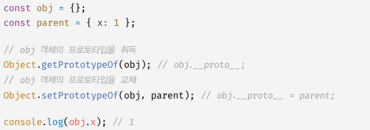
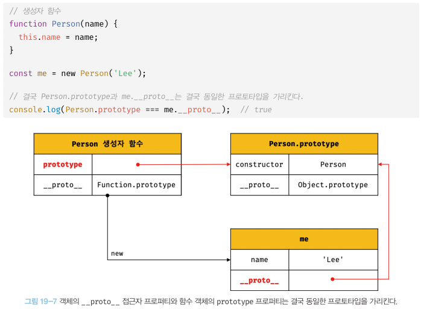

제 19장 프로토타입
====================

자바스크립트는 명령형, 함수형, 프로토타입 기반 객체지향 프로그래밍을 지원하는 멀티 패러다임 프로그래밍 언어다.   
자바스크립트는 객체 기반의 프로그래밍 언어이며. 원시 타입의 값을 제외한 나머지 값들은 모두 객체다.

19.1 객체지향 프로그래밍
-------------------------
객체지향 프로그래밍은 여러 개의 독립적 단위, 즉 객체의 집합으로 프로그램을 표현하려는 패러다임을 말한다.  
**객체** : 상태 데이터와 동작을 하나의 논리적인 단위로 구성한 복합적인 자료구조   
**프로퍼티** : 객체의 상태 데이터   
**메서드** : 동작

19.2 상속과 프로토타입
------------------------
**상속** : 어떤 객체의 프로퍼티 또는 메서드를 다른 객체가 상속받아 그대로 사용할 수 있는 것   

자바스크립트는 프로토타입을 기반으로 상속을 구현하여 불필요한 중복을 제거한다.
 

  </img>

 

* 생성자 함수가 생성할 모든 인스턴스가 공통적으로 사용할 프로퍼티나 메서드를 프로토타입에 미리 구현해두면 생성자 함수가 생성할
모든 인스턴스는 별도의 구현없이 상위 객체인 프로토타입의 자산을 공유하여 사용할 수 있다.

19.3 프로토타입 객체
-----------------------
* 프로토타입 객체란 객체지향 프로그래밍의 근간을 이루는 객체 간 상속을 구현하기 위해 사용된다.   
프로토타입은 어떤 객체의 상위 객체의 역할을 하는 객체로서 다른 객체에 공유 프로퍼티를 제공한다.   
프로토타입을 상속받은 하위 객체는 상위 객체의 프로퍼티를 자신의 프로퍼티처럼 자유롭게 사용할 수 있다.   

* 모든 객체는 [[Prototype]]이라는 내부 슬롯을 가지며, 이 내부 슬롯의 값은 프로토타입의 참조다.   
객체가 생성될 때 객체 생성 방식에 따라 프로토타입이 결정되고 [[Prototype]]에 저장된다.   

* 객체 리터럴에 의해 생성된 객체의 프로토타입은 Object.prototype이고,   
생성자 함수에 의해 생성된 객체의 프로토타입은 생성자 함수의 prototype 프로퍼티에 바인딩되어 있는 객체다.

* 모든 객체는 하나의 프로토타입을 갖는다. 그리고 모든 프로토타입은 생성자 함수와 연결되어 있다.   
 

  </img>

 

[[Prototype]] 내부 슬롯에 직접 접근할 수는 없지만, __ prototype __ 접근자 프로퍼티를 통해 자신의 프로토타입, 즉 자신의 [[Prototype]] 내부 슬롯이 가리키는 프로토타입에 간접적으로 접근할 수 있다.   

프로토타입은 자신의 constructor 프로퍼티를 통해 생성자 함수에 접근할 수 있고, 생성자 함수는 자신의 prototype 프로퍼티를 통해 
프로토타입에 접근할 수 있다.

### 19.3.1 __ prototype __ 접근자 프로퍼티   
모든 객체는 __ prototype __ 접근자 프로퍼티를 통해 자신의 프로토타입, 즉 자신의 [[Prototype]] 내부 슬롯에 간접적으로 접근할 수 있다.

__1. __ prototype __ 는 접근자 프로퍼티다.__
*  [[Prototype]] 내부 슬롯에는 직접 접근할 수 없으며, __ prototype __ 접근자 프로퍼티를 통해 간접적으로 [[Prototype]] 내부 슬롯의 값, 즉 프로토타입에 접근할 수 있다.
*  접근자 프로퍼티는 자체적으로 값([[Value]] 프로퍼티)를 갖지 않고 접근자 함수([[Get]], [[Set]]) 프로퍼티 어트리뷰트로 구성된 프로퍼티다.
*  __ prototype __ 접근자 프로퍼티를 통해 프로토타입에 접근하면 내부적으로 __ prototype __ 접근자 프로퍼티의 [[Get]]이 호출된다.   
__ prototype __ 접근자 프로퍼티를 통해 새로운 프로토타입을 할당하면 __ prototype __ 접근자 프로퍼티의 [[Set]]이 호출된다.

__2. __ prototype __ 접근자 프로퍼티는 상속을 통해 사용된다.__
* __ prototype __ 접근자 프로퍼티는 객체가 직접 소유하는 프로퍼티가 아니라 Object.prototype의 프로퍼티다.   
모든 객체는 상속을 통해 Object.prototype.__ prototype __ 접근자 프로퍼티를 사용할 수 있다.

__3. __ prototype __ 접근자 프로퍼티를 통해 프로토타입에 접근하는 이유__
* [[Prototype]] 내부 슬롯의 값, 즉 프로토타입에 접근하기 위해 접근자 프로퍼티를 사용하는 이유는 상호 참조에 의해 프로토타입 체인이 생성되는 것을 방지하기 위해서이다.
* 프로퍼티 검색 방향이 한쪽 방향으로만 흘러가야 한다. 객체끼리 서로가 자신의 프로토타입이 되는 비정상적인 프로토타입 체인이 만들어지면 프로토타입 체인 종점이 존재하지 않아서 프로퍼티를 검색할 때 무한 루프에 빠진다.

__4. __ prototype __ 접근자 프로퍼티를 코드 내에서 직접 사용하는 것은 권장하지 않는다.__
* 모든 객체가 __ prototype __ 접근자 프로퍼티를 사용할 수 있는 것은 아니다. 직접 상속을 통해 Object.prototype을 상속받지 않는 객체를 생성할 수도 있기 때문에 __ prototype __ 접근자 프로퍼티를 사용할 수 없는 경우가 있다.
* __ prototype __ 접근자 프로퍼티 대신 프로토타입의 참조를 취득하고 싶은 경우에는 Object.getPrototypeOf 메서드를 사용   
프로토타입을 교체하고 싶은 경우에는 Object.setPrototypeOf 메서드를 사용할 것을 권장한다.
 

  </img>

 

### 19.3.2 함수 객체의 prototype 프로퍼티   
* 함수 객체만이 소유하는 prototype 프로퍼티는 생성자 함수가 생성할 인스턴스의 프로토타입을 가리킨다.(일반 객체는 소유 x)   

* 생성자 함수로서 호출할 수 없는 함수, 즉 non-constructor인 화살표 함수와 ES6 메서드 축약 표현으로 정의한 메서드는 prototype 프로퍼티를 소유하지 않으며 프로토타입도 생성하지 않는다.

* 모든 객체가 가지고 있는 (Object.prototype으로부터 상속받은) __ prototype __ 접근자 프로퍼티와 함수 객체만이 가지고 있는 prototype 프로퍼티는 결국 동일한 프로토타입을 가리킨다. 
 

  </img>

 

### 19.3.3 프로토타입의 constructor 프로퍼티와 생성자 함수   
모든 프로토타입은 constructor 프로퍼티를 갖는다.   
이 constructor 프로퍼티는 prototype 프로퍼티로 자신을 참조하고 있는 생성자 함수를 가리킨다.   
이 연결은 생성자 함수가 생성될 때, 즉 함수 객체가 생성될 때 이뤄진다.

19.4 리터럴 표시에 의해 생성된 객체의 생성자 함수와 프로토타입
----------------------------------------------------------------
* 생성자 함수에 의해 생성된 인스턴스는 프로토타입의 constructor 프로퍼티에 의해 생성자 함수와 연결된다.   
이때 constructor 프로퍼티가 가리키는 생성자 함수는 인스턴스를 생성한 생성자 함수다.

* 리터럴 표기법에 의한 객체 생성 방식과 같이 명시적으로 new 연산자와 함께 생성자 함수를 호출하여 인스턴스를 생성하지 않는 객체 생성 방식도 있다.   
리터럴 표기법에 의해 생성된 객체도 물론 프로토타입이 존재한다.   
하지만 이런 객체의 경우 프로토타입의 constructor 프로퍼티가 가리키는 생성자 함수가 반드시 객체를 생성한 생성자 함수라고 단정할 수는 없다. (객체 리터럴에 의해 생성된 객체는 Object 생성자 함수가 생성한 객체가 아니다.)

* 프로토타입은 생성자 함수와 더불어 생성되며 prototype, construtor 프로퍼티에 의해 연결되어 있다.   
프로토타입과 생성자 함수는 단독으로 존재할 수 없고 언제나 쌍으로 존재한다.

* 프로토타입의 constructor 프로퍼티를 통해 연결되어 있는 생성자 함수를, 리터럴 표기법으로 생성한 객체를 생성한 생성자 함수로 생각해도 됨

19.5 프로토타입의 생성 시점
-------------------------------
* 객체는 리터럴 표기법 또는 생성자 함수에 의해 생성되므로 결국 모든 객체는 생성자 함수와 연결되어 있다.
* 프로토타입은 생성자 함수가 생성되는 시점에 더불어 생성된다.

### 19.5.1 사용자 정의 생성자 함수와 프로토타입 생성 시점   
* 생성자 함수로서 호출할 수 있는 함수, 즉 constructor는 함수 정의가 평가되어 함수 객체를 생성하는 시점에 프로토타입도 더불어 생성된다.
* 생성자 함수로서 호출할 수 없는 함수, 즉 non-constructor는 프로토타입이 생성되지 않는다.
* 빌트인 생성자 함수가 아닌 사용자 정의 생성자 함수는 자신이 평가되어 함수 객체로 생성되는 시점에 프로토타입도 더불어 생성되며, 생성된 프로토타입의 프로토타입은 언제나 Obejct.prototype이다.

### 19.5.2 빌트인 생성자 함수와 프로토타입 생성 시점   
* 빌트인 생성자 함수(Object, String, Number, Function, Array ...)도 일반 함수와 같이 빌트인 생성자 함수가 생성되는 시점에 프로토타입이 생성된다.   
모든 빌트인 생성자 함수는 전역 객체가 생성되는 시점에 생성된다.   
생성된 프로토타입은 빌트인 생성자 함수의 prototype 프로퍼티에 바인딩된다.

* 이처럼 객체가 생성되기 이전에 생성자 함수와 프로토타입은 이미 객체화되어 존재한다.   
이후 생성자 함수 또는 리터럴 표기법으로 객체를 생성하면 프로토타입은 생성된 객체의 [[Prototype]] 내부 슬롯에 할당된다.   
이로써 생성된 객체는 프로토타입을 상속받는다.

19.6 객체의 생성 방식과 프로토타입의 결정
------------------------------------------
