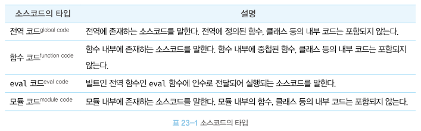
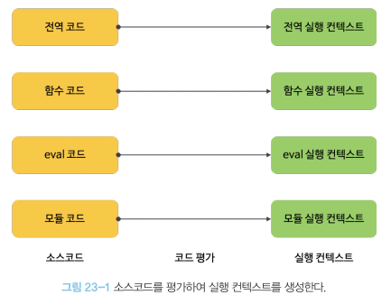

제 23장 실행 컨텍스트
========================
실행 컨텍스트는 자바스크립트의 동작 원리를 담고 있는 핵심 개념.   
실행 컨텍스트를 바르게 이해하면 자바스크립트가 스코프를 기반으로 식별자와 식별자에 바인딩된 값(식별자 바인딩)을 관리하는 방식과 호이스팅이 발생하는 이유, 클로저의 동작 방식,
그리고 태스크 큐와 함께 동작하는 이벤트 핸들러와 비동기 처리의 동작 방식을 이해할 수 있다.

23.1 소스코드의 타입
----------------------
4가지 타입의 소스코드는 실행 컨텍스트를 생성한다.
 

</img>

 
소스 코드를 4가지 타입으로 구분하는 이유는 소스코드의 탑입에 따라 실행 컨텍스트를 생성하는 과정과 관리 내용이 다르기 때문.

**1. 전역 코드**   
전역 코드는 전역 변수를 관리하기 위해 최상위 스코프인 전역 스코프를 생성해야 한다.   
var 키워드로 선언된 전역 변수와 함수 선언문으로 정의된 전역 함수를 전역 객체의 프로퍼티와 메서드로 바인딩하고 참조하기 위해 전역 객체와 연결되어야 한다. 이를 위해 전역 코드가 평가되면 전역 실행 컨텍스트가 생성된다. 

**2. 함수 코드**   
함수 코드는 지역 스코프를 생성하고 지역 변수, 매개변수, arguments 객체를 관리해야 한다.   
그리고 생성한 지역 스코프를 전역 스코프에서 시작하는 스코프 체인의 일원으로 연결해야 한다.   
이를 위해 함수 코드가 평가되면 함수 실행 컨텍스트가 생성된다.

**3. eval 코드**   
eval 코드는 strict mode에서 자신만의 독자적인 스코프를 생성한다. 이를 위해 eval 코드가 평가되면 eval 실행 컨텍스트가 생성된다.

**4. 모듈 코드**   
모듈 코드는 모듈별로 독립적이 모듈 스코프를 생성한다. 이를 위해 모듈 코드가 평가되면 모듈 실행 컨텍스트가 생성된다.

 

</img>

 

23.2 소스코드의 평가와 실행
------------------------------
