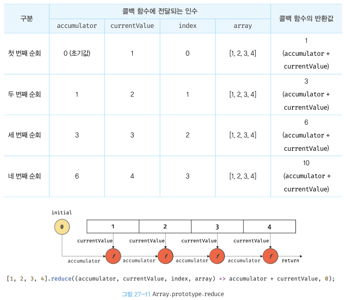

제 27장 배열
=====================
27.1 배열이란?
----------------------
배열은 여러 개의 값을 순차적으로 나열한 자료구조다.   
배열이 가지고 있는 값을 **요소**라고 부른다. 자바스크립의 모든 값(원시값은 물론 객체, 함수, 배열 등)은 배열의 요소가 될 수 있다.   
배열의 요소는 배열에서 자신의 위치를 나타내는 0 이상의 정수인 인덱스를 갖는다. 즉, 배열의 길이를 나타내는 length 프로퍼티를 갖는다.

* 배열은 인덱스와 length 프로퍼티를 갖기 때문에 for문을 통해 순차적으로 요소에 접근할 수 있다.   
자바스크립트에 배열이라는 타입은 존재하지 않는다. 배열은 객체 타입이다.

* 배열은 다음과 같은 방법으로 생성할 수 있다.
- 배열 리터럴
- Array 생성자 함수
- Array.of, Array.from 메서드
배열의 생성자 함수는 Array이며, 배열의 프로토타입 객체는 Array.prototype이다.   
Array.prototype은 배열을 위한 빌트인 메서드를 제공한다.

배열은 객체지만 일반 객체와는 구별되는 독특한 특징이 있다.
<br/>
<p align="center">
</img>
</p>
<br/>
일반 객체와 배열을 구분하는 가장 명확한 차이는 "값의 순서"와 "length 프로퍼티"다.

27.2 자바스크립트 배열은 배열이 아니다
----------------------------------------
자료구조에서 말하는 배열은 동일한 크기의 메모리 공간이 빈틈없이 연속적으로 나열된 자료구조를 말한다.   
즉, 배열의 요소는 하나의 데이터 타입으로 통일되어 있으며 서로 연속적으로 인접해 있다. 이를 밀집배열이라 한다.(js의 배열 X)

* 밀집배열의 장점 : 인덱스를 통해 효율적으로 요소에 접근할 수 있다.   
밀집배열의 단점 : 배열에 요소를 삽입하거나 삭제하는 경우 배열의 요소를 연속적으로 유지하기 위해 요소를 이동시켜야 함

* 자바스크립트의 배열은 지금까지 살펴본 자료구조에서 말하는 일반적인 의미의 배여로가 다르다.   
즉, 배열의 요소를 위한 각각의 메모리 공간은 동일한 크기를 갖지 않아도 되며, 연속적으로 이어져 있지 않을 수도 있다. (이를 희소배열이라 함)   
자바스크립트의 배열(일반적 의미의 배열이 아님) 일반적인 배열의 동작을 흉내 낸 특수한 객체다.   
자바스크립트 배열(해시 테이블로 구현된 객체)은 인덱스를 나타내는 문자열을 프로퍼티 키로 가지며, length 프로퍼티를 갖는 특수한 객체다.

* 자바스크립트 배열은 인덱스로 배열 요소에 접근하는 경우에는 일반적인 배열보다 느리지만 요소를 삽입 또는 삭제하는 경우에는 일반적인 배열보다 빠르다.

27.3 length 프로퍼티와 희소 배열   
-------------------------------------
length 프로퍼티는 요소의 개수를 값으로 갖는다.   
length 프로퍼티의 값은 배열에 요소를 추가하거나 삭제하면 자동 갱신된다.   

현재 length 프로퍼티 값보다 작은 숫자 값을 할당하면 배열의 길이가 줄어든다.   
```javascript
const arr = [1, 2, 3, 4, 5];

//현재 length 프로퍼티 값인 5보다 작은 숫자 값 3을 length 프로퍼티에 할당   
arr.length = 3;

//배열의 길이가 5에서 3으로 줄어든다.   
console.log(arr); // [1, 2, 3]
```

현재 length 프로퍼티 값보다 큰 숫자 값을 할당하는 경우, length 프로퍼티 값은 변경되지만 실제로 배열의 길이가 늘어나지는 않는다.
```javascript
const arr = [1];

//현재 length 프로퍼티 값인 1보다 큰 숫자 값 3을 length 프로퍼티에 할당   
arr.length = 3;

//length 프로퍼티 값은 변경되지만 실제로 배열의 길이가 늘어나지는 않는다.
console.log(arr.length); // 3
console.log(arr); // [1, empty * 2]
```

희소 배열은 length와 배열 요소의 개수가 일치하지 않는다. 희소 배열의 length는 희소 배열의 실제 요소 개수보다 언제나 크다.   
자바스크립트는 문법적으로 희소 배열을 허용하지만 희소 배열은 사용하지 않는 것이 좋다.   
배열에는 같은 타입의 요소를 연속적으로 위치시키는 것이 최선이다.

27.4 배열 생성
----------------------
### 27.4.1 배열 리터럴   
가장 일반적이고 간편한 배열 생성 방식은 배열 리터럴을 사용하는 것이다.   
배열 리터럴은 객체 리터럴과 달리 프로퍼티 키가 없고 값만 존재한다.   
배열 리터럴에 요소를 생략하면 희소 배열이 생성된다.

### 27.4.2 Array 생성자 함수
Array 생성자 함수를 통해 배열을 생성할 수도 있다. Array 생성자 함수는 전달된 인수의 개수에 따라 다르게 동작하므로 주의가 필요하다.   
1. 전달된 인수가 1개이고 숫자인 경우 length 프로퍼티 값이 인수인 배열을 생성한다.
```javascript
const arr = new Array(10);

console.log(arr); // [empty * 10]
console.log(arr.length) // 10
```
이때 생성된 배열은 희소 배열이다. length 프로퍼티 값은 아니지만 실제로 배열의 요소는 존재하지 않는다.

2. 전달된 인수가 없는 경우 빈 배열을 생성한다. 즉, 배열 리터럴 []과 같다.

3. 전달된 인수가 2개 이상이거나 숫자가 아닌 경우 인수를 요소로 갖는 배열을 생성한다.
```javascript
// 전달된 인수가 2개 이상이면 인수를 요소로 갖는 배열을 생성한다.
new Array(1, 2, 3); // -> [1, 2, 3]

// 전달된 인수가 1개지만 숫자가 아니면 인수를 요소로 갖는 배열을 생성한다.
new Array({}); // -> [{}]
```

* Array 생성자 함수는 new 연산자와 함께 호출하지 않더라도, 즉 일반 함수로서 호출해도 배열을 생성하는 생성자 함수로 동작한다.   
이는 Array 생성자 함수 내부에서 new.target을 확인하기 때문이다.
```javascript
Array(1, 2, 3); // -> [1, 2, 3]
```
    
### 27.4.3 Array.of   
ES6에서 도입괸 Array.of 메서드는 전달된 인수를 요소로 갖는 배열을 생성한다.   
Array.of는 Array 생성자 함수와 다르게 전달된 인수가 1개이고 숫자이더라도 인수를 요소로 갖는 배열을 생성한다.
```javascript
// 전달된 인수가 1개이고 숫자이더라도 인수를 요소로 갖는 배열을 생성한다.
Array.of(1); // -> [1]

Array.of(1, 2, 3); // -> [1, 2, 3]

Array.of('string'); // -> ['string']
```

### 27.4.4 Array.from   
ES6에서 도입된 Array.from 메서드는 유사 배열 객체 또는 이터러블 객체를 인수로 전달받아 배열로 변환하여 반환한다.
```javascript
// 유사 배열 객체를 변환하여 배열을 생성한다.
Array.from({ length: 2, 0: 'a', 1: 'b' }); // -> ['a', 'b']

// 이터러블을 변환하여 배열을 생성한다. 문자열은 이터러블이다.
Array.from('Hello'); // -> ['H', 'e', 'l', 'l', 'o']
```

Array.from을 사용하면 두번째 인수로 전달한 콜백 함수를 통해 값을 만들면서 요소를 채울 수 있다.   
Array.from 메서드는 두번째 인수로 전달한 콜백 함수에 첫번째 인수에 의해 생성된 배열의 요소값과 인덱스를 순차적으로 전달하면서 호출하고, 콜백 함수의 반환값으로 구성된 배열을 반환한다. 
```javascript
// Array.from에 length만 존재하는 유사 배열 객체를 전달하면 undefined를 요소로 채운다.
Array.from({ length: 3 }); // -> [undefined, undefined, undefined]

// Array.from은 두번째 인수로 전달한 콜백 함수의 반환값으로 구성된 배열을 반환한다.
Array.from({ length: 3 }, (_, i) => i); // -> [0, 1, 2]
```
<br/>
<p align="center">
</img>
</p>
<br/>

27.5 배열의 참조
---------------------------------
배열의 요소를 참조할 때에는 대괄호([]) 표기법을 사용한다. 대괄호 안에는 인덱스가 와야 한다.   
인덱스는 값을 참조할 수 있다는 의미에서 객체의 프로퍼티 키와 같은 역할을 한다.   
존재하지 않는 요소에 접근하면 undefined가 반환된다.   
배열은 사실 인덱스를 나타내는 문자열을 프로퍼티 키로 갖는 객체다.   

27.6 배열 요소의 추가와 갱신
---------------------------------------
존재하지 않는 인덱스를 사용해 값을 할당하면 새로운 요소가 추가된다. 이때 length 프로퍼티 값은 자동 갱신된다.   
이미 요소가 존재하는 요소에 값을 재할당하면 요소값이 갱신된다.   

인덱스는 요소의 위치를 나타내므로 반드시 0 이상의 정수(또는 정수 형태의 문자열)을 사용해야 한다.   
만약 정수 이외의 값을 인덱스처럼 사용하면 요소가 생성되는 것이 아니라 프로퍼티가 생성된다.   
이때 추가된 프로퍼티는 length 프로퍼티 값에 영향을 주지 않는다.
```javascript
const arr = [];

// 배열 요소의 추가0
arr[0] = 1;
arr['1'] = 2;

// 프로퍼티 추가
arr['foo'] = 3;
arr.bar = 4;
arr[1.1] = 5;
arr[-1] = 6;

console.log(arr); // [1, 2, foo: 3, bar: 4, '1.1': 5, '-1':6]

// 프로퍼티는 length에 영향을 주지 않는다.
console.log(arr.length);  //2
```

27.7 배열 요소의 삭제
------------------------
배열은 사실 객체이기 때문에 특정 요소를 삭제하기 위해 delete 연산자를 사용할 수 있다. (사용하지 않는 것이 좋다)
```javascript
const arr = [1, 2, 3];

// 배열 요소의 삭제
delete arr[1];
console.log(arr); // [1, empty, 3]

// length 프로퍼티에 영향을 주지 않는다. 즉, 희소 배열이 된다
console.log(arr.length) // 3
```

희소 배열을 만들지 않으면서 배열의 특정 요소를 완전히 삭제하려면 Array.prototype.splice 메서드를 사용한다.
```javascript
const arr = [1, 2, 3];

// Array.prototype.splice(삭제를 시작할 인덱스, 삭제할 요소 수)
// arr[1]부터 1개의 요소를 제거
arr.splice(1, 1);
console.log(arr); // [1, 3]

// length 프로퍼티가 자동 갱신된다.
console.log(arr.length); // 2
```

27.8 배열 메서드
-----------------------
Array 생성자 함수는 정적 메서드를 제공하며, 배열 객체의 프로토타입인 Array.prototype은 프로토타입 메서드를 제공한다.   

* 배열 메서드는 결과물을 반환하는 패턴이 두가지이므로 주의가 필요하다.   
- 원본 배열(배열 메서드를 호출한 배열, 즉 배열 메서드의 구현체 내부에서 this가 가리키는 객체)을 직접 변경하는 메서드
- 원본 배열을 직접 변경하지 않고 새로운 배열을 생성하여 반환하는 메서드

* ES5부터 도입된 메서드는 대부분 원본 배열을 직접 변경하지 않지만 초창기 배열 메서드는 원본 배열을 직접 변경하는 경우가 많다. (외부 상태를 직접 변경하는 부수 효과 有)   
가급적 원본 배열을 직접 변경하지 않는 메서드를 사용하는 편이 좋다.

### 27.8.1 Array.isArray   
Array.isArray는 Array 생성자 함수의 정적 메서드다. Array.isArray 메서드는 전달된 인수가 배열이면 true, 배열이 아니면 false를 반환한다.

### 27.8.2 Array.prototype.indexOf   
indexOf 메서드는 원본 배열에서 인수로 전달된 요소를 검색하여 인덱스를 반환한다.   

* 첫번째로 검색된 요소의 인덱스를 반환한다.   
원본 배열에 인수로 전달한 요소가 존재하지 않으면 -1을 반환하다.   
두번째 인수는 검색을 시작할 인덱스다. 두번째 인수를 생략하면 처음부터 검색한다.   

indexOf 메서드는 배열에 특정 요소가 존재하는지 확인할 때 유용하다.   
하지만 indexOf 대신 ES7에서 도입된 Array.prototype.includes 메서드를 사용하면 가독성이 더 좋다.

### 27.8.3 Array.prototype.push   
```javascript
const arr = [1, 2];

// 인수로 전달받은 모든 값을 원본 배열 arr의 마지막 요소로 추가하고 변경된 length 값을 반환한다.
let result = arr.push(3, 4);
console.log(result); //4

// push 메서드는 원본 배열을 직접 변경한다.
console.log(arr); // [1, 2, 3, 4]
```

```javascript
const arr = [1, 2];

// arr.push(3)과 동일한 처리를 한다. 이 방법이 push 메서드보다 빠르다.
arr[arr.length] = 3;
console.log(arr); // [1, 2, 3]
```

push 메서드는 원본 배열을 직접 변경하는 부수 효과가 있다. 그래서 ES6의 스프레드 문법을 사용하는 편이 좋다.   
스프레드 문법을 사용하면 함수 호출 없이 표현식으로 마지막에 요소를 추가할 수 있으며 부수 효과도 없다.

```javascript
const arr = [1, 2];

// ES6 스프레드 문법
const newArr = [...arr, 3];
console.log(newArr); // [1, 2, 3]
```

### 27.8.4 Array.prototype.pop   
```javascript
const arr = [1, 2];

// 원본 배열에서 마지막 요소를 제거하고 제거한 요소를 반환한다.
let result = arr.pop();
console.log(result); //2

// pop 메서드는 원본 배열을 직접 변경한다.
console.log(arr); // [1]
```

* pop 메서드와 push 메서드를 사용하면 스택(후입선출 방식의 자료구조)을 쉽게 구현할 수 있다.   
스택에 데이터를 밀어넣는 것을 push라 하고 스택에서 데이터를 꺼내는 것을 pop이라 한다.

### 27.8.5 Array.prototype.unshift   
```javascript
const arr = [1, 2];

// 인수로 전달받은 모든 값을 원본 배열의 선두에 요소로 추가하고 변경된 length 값을 반환한다.   
let result = arr.unshift(3, 4);
console.log(result); //4

// unshift 메서드는 원본 배열을 직접 변경한다.
console.log(arr); // [3, 4, 1, 2]
```

### 27.8.6 Array.prototype.shift   
```javascript
const arr = [1, 2];

// 원본 배열에서 첫번째 요소를 제거하고 제거한 요소를 반환한다.
let result = arr.shift();
console.log(result); // 1

// shift 메서드는 원본 배열을 직접 변경한다.
console.log(arr); // [2]
```
shift 메서드와 push 메서드를 사용하면 큐(선입선출 방식의 자료구조)를 쉽게 구현할 수 있다.

### 27.8.7 Array.prototype.concat   
```javascript
// 배열 arr2를 원본 배열 arr1의 마지막 요소로 추가한 새로운 배열을 반환한다.
// 인수로 전달한 값이 배열인 경우 배열을 해체하여 새로운 배열의 요소로 추가한다.
let result = arr1.concat(arr2);
console.log(result); // [1, 2, 3, 4]

// 숫자를 원본 배열 arr1의 마지막 요소로 추가한 새로운 배열을 반환한다.
result = arr1.concat(3);
console.log(result); // [1, 2, 3]

// 배열 arr2와 숫자를 원본 배열 arr1의 마지막 요소로 추가한 새로운 배열을 반환한다.
result = arr1.concat(arr2, 5);
console.log(result); // [1, 2, 3, 4, 5]

// 원본 배열은 변경되지 않는다.
console.log(arr1); // [1, 2]
```
* push와 unshift 메서드는 concat 메서드로 대체할 수 있다.   
push와 unshift는 원본 배열을 변경하지만 concat은 원본 배열을 변경하지 않고 새로운 배열을 반환.   
따라서 push와 unshift를 사용할 경우 원본 배열을 반드시 변수에 저장해둬야하며 concat을 사용할 경우 반환값을 반드시 변수에 할당받아야 한다.

* 인수로 전달받은 값이 배열인 경우 push와 unshift 메서드는 배열을 그대로 원본 배열의 마지막/첫번째 요소로 추가하지만 concat은 인수로 전달받은 배열을 해체하여 새로운 배열의 마지막 요소로 추가한다.

* concat 메서드는 ES6의 스프레드 문법으로 대체할 수 있다.
 ```javascript
let result = [1, 2].concat([3, 4]);
console.log(result); // [1, 2, 3, 4]

//concat 메서드는 ES6의 스프레드 문법으로 대체할 수 있다.
result = [...[1, 2], ...[3, 4]];
console.log(result); // [1, 2, 3, 4]
```
스프레드 문법을 일관성있게 사용하는 것을 권장함

### 27.8.8 Array.prototype.splice   
<br/>
<p align="center">
</img>
</p>
<br/>
원본 배열의 중간에 요소를 추가하거나 중간에 있는 요소를 제거하는 경우 splice 메서드를 사용한다.   
splice 메서드는 3개의 매개변수가 있으며 원본 배열을 직접 변경한다.
<br/>
<p align="center">
</img>
</p>
<br/>
<p align="center">
</img>
</p>
<br/>
* 배열에서 특정 요소를 제거하려면 indexOf 메서드를 통해 특정 요소의 인덱스를 취득한 다음 splice 메서드를 사용한다.   
filter 메서드를 사용하여 특정 요소를 제거할 수도 있다. 하지만 특정 요소가 중복된 경우 모두 제거된다.

### 27.8.9 Array.prototype.slice   
slice 메서드는 인수로 전달된 범위의 요소들을 복사하여 배열로 반환한다. 원본 배열은 변경되지 않는다. (splice는 원본 배열을 변경)   
slice 메서드는 두 개의 매개변수를 갖는다.
<br/>
<p align="center">
</img>
</p>
<br/>
<p align="center">
</img>
</p>
<br/>
생성된 복사본은 얕은 복사를 통해 생성된다.

### 27.8.10 Array.prototype.join
```javascript
const arr = [1, 2, 3, 4];

// 기본 구분자는 콤마다.
// 원본 배열 arr의 모든 요소를 문자열로 변환한 후 기본 구분자로 연결한 문자열을 반환한다.
arr.join(); // -> '1, 2, 3, 4';

// 원본 배열 arr의 모든 요소를 문자열로 변환한 후, 빈 문자열로 연결한 문자열을 반환한다.
arr.join(''); // -> '1234'
```

### 27.8.11 Array.prototype.reverse   
```javascript
const arr = [1, 2, 3];
const result = arr.reverse();

// reverse 메서드는 원본 배열을 직접 변경한다.
console.log(arr); // [3, 2, 1]
// 반환값은 변경된 배열이다.
console.log(result); // [3, 2, 1]
```

### 27.8.12 Array.prototype.fill   
```javascript
const arr = [1, 2, 3];

//인수로 전달받은 값 0을 배열의 처음부터 끝까지 요소로 채운다.
arr.fill(0);

//fill 메서드는 원본 배열을 직접 변경한다.
console.log(arr); // [0, 0, 0]
```
두번째 인수로 요소 채우기를 시작할 인덱스를 전달할 수 있다.   
세번째 인수로 요소 채우기를 멈출 인덱스를 전달할 수 있다.   

### 27.8.13 Array.prototype.includes   
```javascript
const arr = [1, 2, 3];

//배열에 요소 2가 포함되어 있는지 확인한다.
arr.includes(2) // -> true
```
두번째 인수로 검색을 시작할 인덱스를 전달할 수 있다. 두번째 인수를 생략할 경우 기본값 0이 설정된다.   
만약 두번째 인수에 음수를 전달하면 length 프로퍼티 값과 음수 인덱스를 합산하여 검색 시작 인덱스를 설정한다.

### 27.8.14 Array.prototype.flat   
ES10에서 도입된 flat 메서드는 인수로 전달한 깊이만큼 재귀적으로 배열을 평탄화한다.

27.9 배열 고차 함수
-----------------------
고차 함수는 함수를 인수로 전달받거나 함수를 반환하는 함수를 말한다.   
고차 함수는 외부 상태의 변경이나 가변 데이터를 피하고 불변성을 지향하는 함수형 프로그래밍에 기반을 두고 있다.   
함수형 프로그래밍은 결국 순수 함수를 통해 부수 효과를 최대한 억제하여 오류를 피하고 프로그램의 안전성을 높이려는 것이다.

### 27.9.1 Array.prototype.sort   
```javascript
const fruits = ['Banana', 'Apple', 'Orange'];

// 오름차순 정렬
fruits.sort();

// sort 메서드는 원본 배열을 직접 변경한다.
console.log(fruits); // ['Apple', 'Banana', 'Orange']
```

* 내림차순으로 요소를 정렬하려면 sort 메서드를 사용하여 오름차순으로 정렬한 후 reverse 메서드를 사용하여 순서를 뒤집는다.

* sort 메서드의 기본 정렬 순서는 유니코드 포인트의 순서를 따른다.   
따라서 숫자 요소를 정렬할 때는 sort 메서드에 정렬 순서를 정의하는 비교 함수를 인수로 전달해야 한다.
```javascript
const points = [40, 100, 1, 5, 2, 25, 10];

// 숫자 배열의 오름차순 정렬. 비교 함수의 반환값이 0보다 작으면 a를 우선하여 정렬한다.
points.sort((a, b) => a - b);
console.log(points); // [1, 2, 5, 10, 25, 40, 100]

// 숫자 배열의 내림차순 정렬. 비교 함수의 반환값이 0보다 작으면 b를 우선하여 정렬한다.
points.sort((a,b) => b - a);
console.log(points); // [100, 40, 25, 10, 5, 2, 1]
```

### 27.9.2 Array.prototype.forEach   
forEach 메서드는 for문을 대체할 수 있는 고차 함수다. 자신의 내부에서 반복문을 실행한다.   
즉, forEach 메서드는 반복문을 추상화한 고차 함수로서 내부에서 반복문을 통해 자신을 호출한 배열을 순회하면서 수행해야 할 처리를 콜백 함수로 전달받아 반복 호출한다.
```javascript
const number = [1, 2, 3];
const pows = [];

// forEach 메서드는 numbers 배열의 모든 요소를 순회하면서 콜백 함수를 반복 호출한다.   
numbers.forEach(item => pows.push(item ** 2));
console.log(pows); // [1, 4, 9]
```
forEach 메서드를 호출한 배열의 요소값과 인덱스, forEach 메서드를 호출한 배열(this)을 순차적으로 전달한다.
```javascript
// forEach 메서드는 콜백 함수를 호출하면서 3개(요소값, 인덱스, this)의 인수를 전달한다.(map, filter의 인수도 마찬가지)
[1, 2, 3].forEach((item, index, arr) => {
    console.log(`요소값: ${item}, 인덱스: ${index}, this: ${JSON.stringfy(arr)}`);
});
/*
요소값: 1, 인덱스: 0, this: [1, 2, 3]
요소값: 2, 인덱스: 1, this: [1, 2, 3]
요소값: 3, 인덱스: 2, this: [1, 2, 3]
*/
```

forEach 메서드는 원본 배열(forEach를 호출할 배열)을 변경하지 않는다. 하지만 콜백 함수를 통해 원본 배열을 변경할 수는 있다.   
```javascript
const numbers = [1, 2, 3];

//콜백 함수의 세번째 매개변수 arr은 원본 배열 numbers를 가리킨다.
//따라서 콜백 함수의 세번째 매개변수 arr을 직접 변경하면 원본 배열 numbers가 변경된다.
numbers.forEach((item, index, arr) => { arr[index] = item ** 2; });
console.log(numbers); // [1, 4, 9]
```

* forEach 메서드의 반환값은 언제나 undefined다.   

* forEach 메서드의 두번째 인수로 forEach 메서드의 콜백 함수 내부에서 this로 사용할 객체를 전달 할 수 있다.   
더 나은 방법은 ES6의 화살표 함수를 사용하는 것이다. 화살표 함수는 함수 자체의 this 바인딩을 갖지 않는다.   
따라서 화살표 함수 내부에서 this를 참조하면 상위 스코프의 this를 그대로 참조한다.

* forEach 메서드는 for문과 달리 break, continue 문을 사용할 수 없다.   
배열의 모든 요소를 빠짐없이 모두 순회하며 중간에 순회를 중단할 수 없다.   
(희소 배열의 경우 존재하지 않는 요소는 순회 대상에서 제외된다. map, filter, reduce 메서드 등에서도 마찬가지)

### 27.9.3 Array.prototype.map   
map 메서드는 자신을 호출한 배열의 모든 요소를 순회하면서 인수로 전달받은 콜백 함수를 반복 호출한다.   
그리고 콜백 함수의 반환값들로 구성된 새로운 배열을 반환한다. 이때 원본 배열은 변경되지 않는다.

* forEach와 map의 공통점 : 자신을 호출한 배열의 모든 요소를 순회하면서 인수로 전달받은 콜백 함수를 반복 호출한다.   
forEach와 map의 차이점 : forEach는 언제나 undefined를 반환하고, map은 콜백 함수의 반환값들로 구성된 새로운 배열을 반환함.

* map 메서드가 생성하여 반환하는 새로운 배열의 length 프로퍼티 값은 map 메서드를 호출한 배열의 length 프로퍼티 값과 반드시 일치한다.   
즉, map 메서드를 호출한 배열과 map 메서드가 생성하여 반환한 배열은 1:1 매핑한다.

### 27.9.4 Array.prototype.filter   
filter 메서드는 자신을 호출한 배열의 모든 요소를 순회하면서 인수로 전달받은 콜백 함수를 반복 호출한다.   
```javascript
const numbers = [1, 2, 3, 4, 5];

//콜백 함수의 반환값이 true인 요소로만 구성된 새로운 배열을 반환한다.
//다음의 경우 numbers 배열에서 홀수인 요소만 필터링한다.(1은 true로 평가된다.)
const odds = numbers.filter(item => item % 2);
console.log(odds); // [1, 3, 5]
```
filter 메서드가 생성하여 반환한 새로운 배열의 length 프로퍼티 값은 filter 메서드를 호출한 배열의 length 프로퍼티 값과 같거나 작다.

### 27.9.5 Array.prototype.reduce   
reduce 메서드는 자신을 호출한 배열의 모든 요소를 순회하면서 인수로 전달받은 콜백 함수를 반복 호출한다.   
그리고 콜백 함수의 반환값을 다음 순회 시에 콜백 함수의 첫번째 인수로 전달하면서 콜백 함수를 호출하여 하나의 결과값을 만들어 반환한다.   
이 때 원본 배열은 변경되지 않는다.

* reduce 메서드는 첫번째 인수로 콜백 함수, 두번째 인수로 초기값을 전달받는다. (두번째 인수는 옵션)   
reduce 메서드의 콜백 함수에는 4개의 인수, (1)초기값 또는 콜백 함수의 이전 반환값 (2) reduce 메서드를 호출한 배열의 요소값 (3) reduce 메서드를 호출한 배열의 인덱스 (4) reduce 메서드를 호출한 배열 자체, 즉 this

```javascript
// 1부터 4까지 누적을 구한다.  
const sum = [1, 2, 3, 4].reduce((accumulator, currentValue, index, array) => accumulator + currentValue, 0);

console.log(sum); //10
```
<br/>
<p align="center">
</img>
</p>

### 27.9.6 Array.prototype.some
some 메서드는 자신을 호출한 배열의 모든 요소를 순회하면서 인수로 전달받은 콜백 함수를 반복 호출한다.   
이때 some 메서드는 콜백 함수의 반환값이 단 한번이라도 참이면 true, 모두 거짓이면 false를 반환한다.   
some 메서드를 호출한 배열이 빈 배열인 경우 언제나 false를 반환.

* some 메서드의 콜백 함수는 (1) some 메서드를 호출한 요소값 (2) some 메서드를 호출한 인덱스 (3) some 메서드를 호출한 배열 자체, 즉 this

### 27.9.7 Array.prototype.every   
every 메서드는 자신을 호출한 배열의 모든 요소를 순회하면서 인수로 전달받은 콜백 함수를 반복 호출한다.   
콜백 함수의 반환값이 모두 참이면 true, 단 한번이라도 거짓이면 false를 반환 (빈 배열이면 언제나 true)

* every 메서드의 콜백 함수는 (1) every 메서드를 호출한 요소값 (2) every 메서드를 호출한 인덱스 (3) every 메서드를 호출한 배열 자체, 즉 this

### 27.9.8 Array.prototype.find   
자신을 호출한 배열의 모든 요소를 순회하면서 인수로 전달받은 콜백 함수를 호출하여 반환값이 true인 첫번째 요소를 반환한다.   
콜백 함수의 반환값이 true인 요소가 존재하지 않는다면 undefined를 반환한다.

* find 메서드의 콜백 함수는 (1) find 메서드를 호출한 요소값 (2) find 메서드를 호출한 인덱스 (3) find 메서드를 호출한 배열 자체, 즉 this

* filter 메서드는 콜백 함수의 호출 결과가 true인 요소만 추출한 새로운 배열을 반환한다. (반환값 언제나 배열)   
find 메서드는 콜백 함수의 반환값이 true인 첫번째 요소를 반환하므로 find의 결과값은 배열이 아닌 해당 요소값이다.

### 27.9.9 Array.prototype.findIndex   
자신을 호출한 배열의 모든 요소를 순회하면서 인수로 전달받은 콜백 함수를 호출하여 반환값이 true인 첫번째 요소의 인덱스를 반환한다.   
콜백 함수의 반환값이 true인 요소가 존재하지 않는다면 -1을 반환한다.

* findIndex 메서드의 콜백 함수는 (1) findIndex 메서드를 호출한 요소값 (2) findIndex 메서드를 호출한 인덱스 (3) findIndex 메서드를 호출한 배열 자체, 즉 this

### 27.9.10 Array.prototype.flatMap   
flatMap 메서드는 map 메서드를 통해 생성된 새로운 배열을 평탄화한다.   
즉, map 메서드와 flat 메서드(인수로 평탄화 깊이 지정 가능)를 순차적으로 실행하는 효과가 있다. (1단계만 평탄화)
