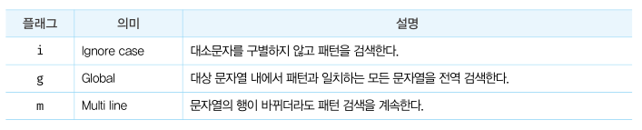

제 31장 RegExp
==================
31.1 정규 표현식이란?
----------------------------
정규 표현식은 일정한 패턴을 가진 문자열의 집합을 표현하기 위해 사용하는 형식 언어다.   
정규 표현식은 자바스크립트의 고유 문법이 아니며, 대부분의 프로그래밍 언어와 코드 에디터에 내장되어 있다. 

31.2 정규 표현식의 생성
------------------------------
정규 표현식 객체를 생성하기 위해서는 정규 표현식 리터럴과 RegExp 생성자 함수를 사용할 수 있다. 
정규 표현식은 리터럴은 패턴과 플래그로 구성된다.
 

</img>

 

31.3 RegExp 메서드
------------------------
### 31.3.1 RegExp.prototype.exec   
exec 메서드는 인수로 전달받은 문자열에 대해 정규 표현식의 패턴을 검색하여 매칭 결과를 배열로 반환한다.   
(없으면 null, 첫번째 매칭 결과만 반환)

### 31.3.2 RegExp.prototype.test   
test 메서드는 인수로 전달받은 문자열에 대해 정규 표현식의 패턴을 검색하여 매칭 결과를 불리언 값으로 반환한다.

### 31.3.3 String.prototype.match   
String 표준 빌트인 객체가 제공하는 match 메서드는 대상 문자열과 인수로 전달받은 정규 표현식과의 매칭 결과를 배열로 반환한다. (모든 결과 반환)

31.4 플래그
--------------------
패턴과 함께 정규 표현식을 구성하는 플래그는 정규 표현식의 검색 방식을 설정하기 위해 사용한다. (옵션)   
 

</img>

 

31.5 패턴
------------------
정규 표현식은 패턴과 플래그로 구성된다.   
정규 표현식의 패턴은 문자열의 일정한 규칙을 표현하기 위해 사용하며, 플래그는 정규 표현식의 검색 방식을 설정하기 위해 사용한다.   
패턴은 /로 열고 닫으며 문자열의 따옴표는 생략한다.
