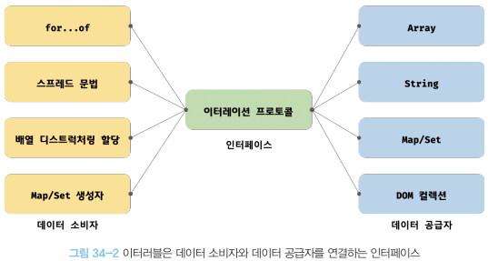

제 34장 이터러블
====================

34.1 이터레이션 프로토콜
--------------------------
ES6에서 도입된 이터레이션 프로토콜은 순회 가능한 데이터 컬렉션(자료구조)을 만들기 위해 ECMAScript 사양에 정의하여 미리 약속한 규칙이다.   
ES6 이전의 순회 가능한 데이터 컬렉션(배열, 문자열, 유사배열객체, DOM 컬렉션)은 통일된 규약없이 for문, for ... in문, orEach 메서드 등 다양한 방법으로 순회했다.   
ES6에서는 순회 가능한 데이터 컬렉션을 이터레이션 프로토콜을 준수하는 이터러블로 통일하여 for ...of문, 스프레드 문법, 배열 디스트럭처링 할당의 대상으로 사용할 수 있도록 일원화했다.   

이터레이션 프로토콜에는 **이터러블 프로토콜**과 **이터레이터 프로토콜**이 있다.
<br/>
<p align="center">
</img>
</p>
<br/>
<p align="center">
</img>
</p>
<br/>

### 34.1.1 이터러블   
이터러블 프로토콜을 준수한 객체를 이터러블이라 한다.   
즉, 이터러블은 Symbol.iterator을 프로퍼티 키로 사용한 메서드를 직접 구현하거나 프로토타입 체인을 통해 상속받은 객체를 말한다.

* 배열은 Array.prototype의 Symbol.iterator 메서드를 상속받는 이터러블이다.   
이터러블은 for ...of문으로 순회할 수 있으며, 스프레드 문법과 배열 디스트럭처링 할당의 대상으로 사용할 수 있다.

### 34.1.2 이터레이터   
이터러블의 Symbol.iterator 메서드를 호출하면 이터레이터 프로토콜을 준수한 이터레이터를 반환한다.   
이터러블의 Symbol.iterator 메서드가 반환한 이터레이터는 next 메서드를 갖는다.
이터레이터의 next 메서드는 이터러블의 각 요소를 순회하기 위한 포인터의 역할을 한다.   
즉, next 메서드를 호출하면 이터러블을 순차적으로 한 단계씩 순회하며 순회 결과를 나타내는 이터레이터 리절트 객체를 반환한다.

34.2 빌트인 이터러블
----------------------
자바스크립트는 이터레이션 프로토콜을 준수한 객체인 빌트인 이터러블을 제공한다. 다음의 표준 빌트인 객체들은 빌트인 이터러블이다.
<br/>
<p align="center">
</img>
</p>
<p align="center">
</img>
</p>
<br/>

34.3 for ... of 문
-----------------------
for ... of문은 이터러블을 순회하면서 이터러블의 요소를 변수에 할당한다.
```javascript
for (변수선언문 of 이터러블) { ... }

//for ... of문은 for ... in문의 형식과 매우 유사하다.
for (변수선언문 in 객체) { ... }
```
* for ... in문은 객체의 프로토타입 체인 상에 존재하는 모든 프로토타입의 프로퍼티 중에서 [[Enumerable]]값이 true인 프로퍼티를 순회하여 열거한다.   
이때 프로퍼티 키가 심벌인 프로퍼티는 열거하지 않는다.
* for ... of문은 내부적으로 이터레이터의 next 메서드를 호출하여 이터러블을 순회하며 next 메서드가 반환한 이터레이터 리절트 객체의 value 프로퍼티 값을 for ... of문의 변수에 할당한다. 그리고 이터레이터 리절트 객체의 done 프로퍼티 값이 false이면 이터러블의 순회를 계속하고 true이면 이터러블의 순회를 중단한다.

34.4 이터러블과 유사 배열 객체
-------------------------------
유사 배열 객체는 마치 배열처럼 인덱스로 프로퍼티 값에 접근할 수 있고 length 프로퍼티를 갖는 객체를 말한다.   
length 프로퍼티를 가지므로 for문으로 순회할 수 있고, 인덱스를 나타내는 숫자 형식의 문자열을 프로퍼티 키로 가지므로 배열처럼 인덱스로 프로퍼티 값에 접근할 수 있다.

유사 배열 객체는 이터러블이 아닌 일반 객체다. 따라서 유사 배열 객체에는 Symbol.iterator 메서드가 없기 때문에 for ... of 문으로 순회할 수 없다.
(arguments, NodeList, HTMLCollection은 유사 배열 객체이면서 이터러블이다.)

34.5 이터레이션 프로토콜의 중요성
------------------------------------
이터레이션 프로토콜은 다양한 데이터 공급자가 하나의 순회 방식을 갖도록 규정하여 데이터 소비자가 효율적으로 다양한 데이터 공급자를 사용할 수 있도록 데이터 소비자와 데이터 공급자를 연결하는 인터페이스의 역할을 한다.
<br/>
<p align="center">
</img>
</p>
<br/>

34.6 사용자 정의 이터러블
----------------------------
### 34.6.1 사용자 정의 이터러블 구현   
이터레이션 프로토콜을 준수하지 않는 일반 객체도 이터레이션 프로토콜을 준수하도록 구현하면 사용자 정의 이터러블이 된다.   
이터러블은 for ...of문뿐만 아니라 스프레드 문법, 배열 디스트럭처링 할당에도 사용할 수 있다.
